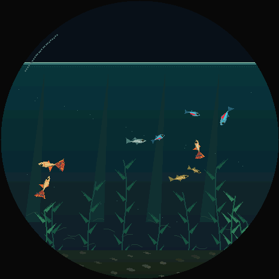
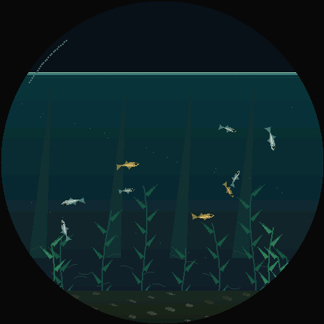

[日本語](README.md) | [English](README.en.md)

# Medaka — 手のひらの水槽

M5Stack StopWatch C152を、9匹のメダカが泳ぐ小さな水槽にする観賞用アプリです。加速度と3軸ジャイロを使い、本体を揺らす・ひねる動きに水面と水草が反応します。


<details>
<summary>動くプレビューを見る</summary>



</details>

*実機と共通のシミュレーション・描画コードによるプレビューです。実機写真・録画ではありません。*

## 特徴

- 大きな波と、動きを止めた後に徐々に静まる揺り返し。
- 尾びれの動き、加速と滑走、群れへの追従、個体間の回避、揺れへの反応。
- なびく水草、水深による色、控えめな光の表現。
- 観賞中は時計やメニューを表示せず、音・振動も使いません。

## 操作

| 操作 | 動作 |
| --- | --- |
| 左右に傾ける | 水面が傾く |
| 揺らす・ひねる | 加速度・回転速度に応じて波と揺り返しが生じる |
| 画面をタップ | タップした横位置に波を起こす |
| 黄色Aをクリック | 左側にエサを6粒投入 |
| 黄色Aを長押し | 通常／暗めの観賞モード |
| 青色Bをクリック | 右側にエサを6粒投入 |

設定は保存しません。再起動時は通常モードに戻ります。IMUの初期化に失敗した場合は画面に表示し、自律遊泳とタップ操作は続けます。

## エサやり

エサは水面からゆっくり沈み、メダカが近くの粒に集まって食べます。食べ終わると通常の遊泳に戻ります。1回6粒、同時に最大24粒まで。投入間隔は最低0.35秒で、食べ残しは24秒で消えます。長押しで明るさを変えた場合はエサを投入しません。



*実機と共通コードによるシミュレーションです。実機の録画ではありません。*

## ビルド・書き込み

対象は**StopWatch C152のみ**です。PlatformIOをインストールして、このフォルダーで実行してください。

```sh
pio run
pio device list
pio run -t upload --upload-port <確認したStopWatchのポート>
```

書き込みは本体の既存アプリを置き換えます。ダウンロードモードが必要な場合は、USB接続中に電源ボタンを約2秒押し、緑LEDが点灯したら離してください。書き込み後に待機状態のままなら、電源ボタンを短く押します。

依存するM5Unified 0.2.21とM5GFX 0.2.28はコミット指定で固定しています。初回ビルドには依存物を取得するためのネット接続が必要です。アプリ本体にはWi-Fi接続、外部送信、クラウド連携、認証情報の設定処理を実装していません。

## テストと実機確認

```sh
c++ -std=c++17 -O2 test/physics.cpp -o /tmp/medaka-physics
/tmp/medaka-physics
c++ -std=c++17 -O2 test/preview.cpp -o /tmp/medaka-preview
/tmp/medaka-preview 180
```

プレビューの各フレームは `/tmp/medaka-frame-000.ppm` 以降に出力します。

確認済み:

- 左右の投入テストで6粒すべてを15秒以内に消費。連打制限・粒数上限・食べ残しの消滅も確認。

- C152向けのビルド、USB書き込み、転送データのハッシュ照合。
- 通常起動、IMUとPSRAMの初期化、描画フレーム数の増加、ジャイロ値の応答。
- 10分相当の加速度・3軸回転・タップの複合テスト、魚の水中・画面内制約、波の平均変位と減衰。
- 人工的なジャイロ入力だけで、大きな揺れ成分が最大38.8px、停止後2秒間の最大が16.5px、10秒時点で1px未満。

実際に揺らしたときの軸方向・見た目、タッチ・ボタン、電池持ちは未検証です。最大約30fpsを目標とした描画スケジュールですが、実機での30fps達成は保証していません。CIは未設定で、上記はローカルの検証結果です。

USBシリアル（115200bps）に `?` を送ると、IMU状態、描画フレーム数、傾き、揺れ、ジャイロZ軸、エサの残数・食べた粒数、空きヒープを返します。

## 実装

| ファイル | 内容 |
| --- | --- |
| `src/World.h` | 120Hz固定ステップの水面と魚のモデル、ジャイロ・加速度入力 |
| `src/Scene.h` | 水槽・魚・水草の共通描画 |
| `src/main.cpp` | StopWatchの画面・センサー・操作 |
| `test/physics.cpp` | 数値モデルのテスト |
| `test/preview.cpp` | デスクトップ参照描画 |

小さな画面で自然な印象を出す2D近似です。厳密な3D流体解析ではありません。水面は画面内の12〜240pxに制限し、極端な傾きや上下逆さの回転は再現しません。

## 公式資料

- [StopWatchの仕様と操作](https://docs.m5stack.com/en/core/StopWatch)
- [M5Unified](https://github.com/m5stack/M5Unified)
- [M5GFX](https://github.com/m5stack/M5GFX)
